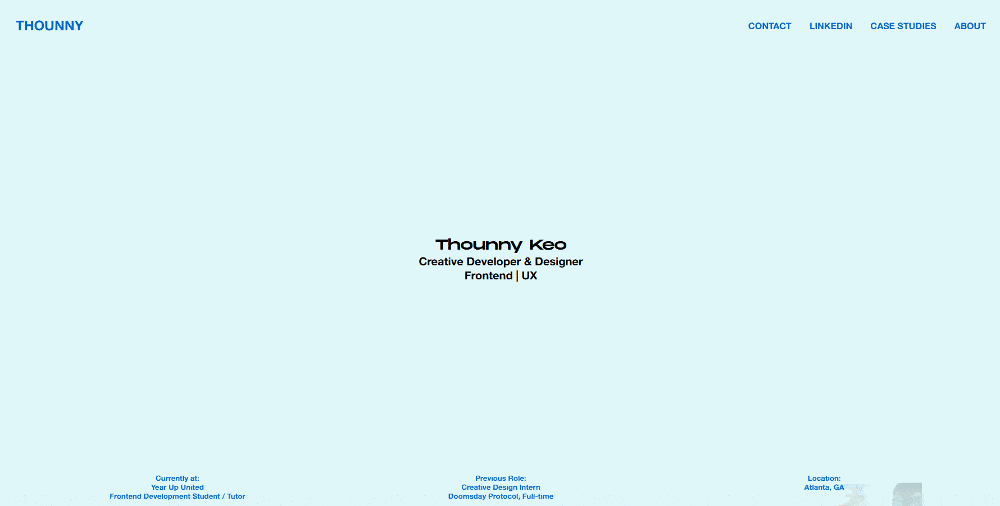

# DAY_025 | Interactive Image Trail with GSAP Animation

## Project Overview

For **DAY_025** of my daily code challenge series, I developed an **interactive image trail effect** that follows the cursor, using **HTML**, **CSS**, **JavaScript**, and **GSAP**. As the user moves their mouse, images smoothly appear, follow the cursor's movement, and then fade out, creating a visually engaging trail effect. This project showcases advanced animation sequencing and smooth transitions using GSAP.

---

### Inspiration from Modern Interactive Design

This image trail effect was inspired by popular interactive designs that use mouse tracking and animation to create a dynamic, engaging experience for users. Also, I had worked on this awhile back and decided to finish it hehe.

---

## Preview




---

## Key Features

- **GSAP Animation**: Each image in the trail fades in, follows the cursor, and then fades out smoothly, creating a fluid trail effect.
- **Mouse Tracking with JavaScript**: Real-time mouse position tracking controls the appearance and movement of images in the trail.
- **Dynamic Image Loading**: The `imagesloaded` library ensures that animations only start after all images have fully loaded, preventing timing issues.
- **Minimal and Modern Design**: A clean, responsive layout with a focus on interactive animation.

---

## JavaScript and Animation Details

### JavaScript Libraries Used

1. **imagesloaded.pkgd.min.js**:
   - Ensures that all images in the gallery are completely loaded before animations start, preventing layout shifts and optimizing timing for smoother interactions.

2. **TweenMax.min.js** (from GSAP):
   - Provides the animations that allow each image to smoothly appear, follow the cursor, and then disappear. This library gives precise control over transitions, easing, and timing.

3. **script.js**:
   - Contains custom JavaScript code to manage the image trail effect. It listens for mouse movements, calculates the distance moved, and triggers animations using GSAP and `imagesloaded`.

### GSAP Animation Breakdown in `script.js`

```javascript
const tl = gsap.timeline({ paused: true });
tl.from(".content__img", { opacity: 0, y: 20, stagger: 0.1, duration: 0.5, ease: "power2.out" });
```

- **Timeline Setup**: A GSAP timeline is initialized in a paused state, waiting for user interaction to start the animation sequence.
- **Image Animation (`.content__img`)**: Each image fades in from an opacity of 0, slightly moves upwards, and then follows the cursor.
- **Ease and Duration**: `power2.out` easing controls the speed and smoothness, ensuring each animation feels polished and responsive.

### Key Sections of `script.js`

- **MathUtils**: A helper object with functions for linear interpolation (`lerp`) and calculating distance between two points.
- **getMousePos**: Tracks the mouse position in real-time, ensuring animations respond directly to user movement.
- **Classes (`Image` and `ImageTrail`)**:
  - **Image**: Represents each individual image in the trail, storing its properties and checking if it’s actively being animated.
  - **ImageTrail**: Manages the image trail effect by showing and animating each image based on mouse movement and distance.

### How JavaScript Enhances the Experience

The combination of `imagesloaded`, `TweenMax`, and custom JavaScript in `script.js` creates a fluid, engaging interaction as images follow and fade out with the cursor. GSAP's control over animation sequences and easing enhances the user experience, making the interaction feel smooth and responsive.

---

## How to Run

1. **Clone the repository**:

   ```bash
   git clone https://github.com/thounny/DAY_025.git
   ```

2. **Navigate to the project directory**:

   ```bash
   cd DAY_025
   ```

3. **Open the `index.html` file** in your browser, or use a local development server like **Live Server** in VSCode.

---

## Project Structure

```bash
DAY_025/
│
├── assets/
├── fonts/
├── images/
├── js/
│   └── imagesLoaded.pkgd.min.js
│   └── script.js
│   └── TweenMax.min.js
├── about.html
├── case-studies.html
├── contact.html
├── index.html
├── styles.css
```

---

## Technologies Used

- **HTML5**: Provides the basic structure and layout of the image trail.
- **CSS3**: Handles the styling and layout adjustments for a clean, responsive interface.
- **JavaScript (ES6)**: Manages the trail functionality, tracking mouse movement and calculating distances.
- **GSAP (GreenSock Animation Platform)**: Powers the smooth and complex animations that make each image trail look dynamic.
- **imagesloaded.pkgd.min.js**: Ensures animations only begin after images are fully loaded for smoother visuals.

---

## Author


**Thounny Keo**  
Creative Developer & Designer  
Frontend Development Student | Year Up United

---

